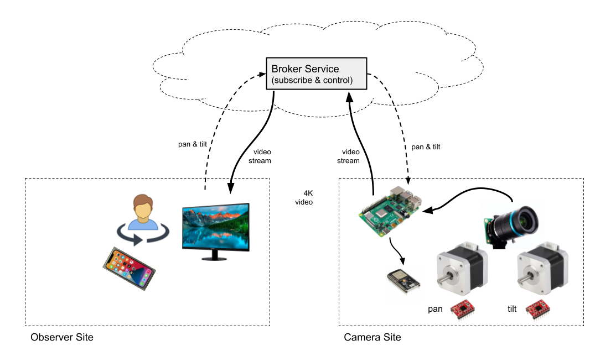
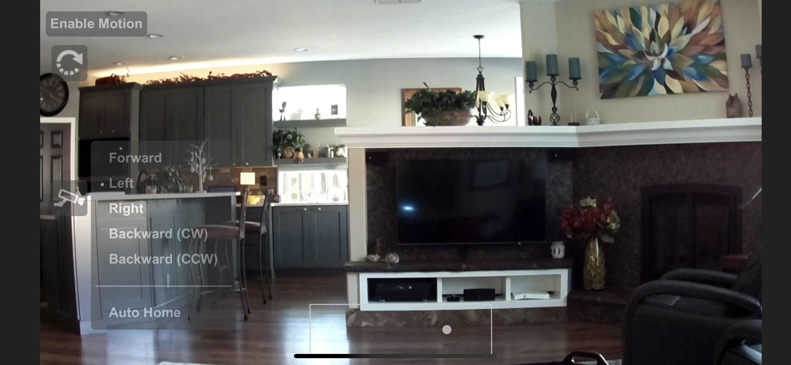

# Overview
The project provides a high-quality and low-latency video stream using Raspberry Pi HQ camera while allowing control of 
the camera orientation on pan & tilt axes. The video stream can be viewed using any modern browser or mobile device.
The camera orientation can be controlled using several different means. On mobile devices, it can be controlled using
touch swipe gestures or by moving the mobile device in 3D space. On desktop or laptop computers, the keyboard or mouse
drag gestures can be used.


The project is an adaptation of the [131/h264-live-player](https://github.com/131/h264-live-player) project. It differs
from the original project in number of ways, with the most important distinction being that the camera code is structured
as a client that connects to a broker, which is capable of brokering connections to multiple cameras and allows
multiple viewers to view the same camera.



This arrangement is better suited for deployment of cameras behind firewalls.

The video stream from the camera can be viewed on any modern browser. The pan/tilt can be controlled using several 
different means.

* Using mouse click-and-drag or tap-and-drag on touch devices
* Using arrow keyboard keys and other keyboard short-cuts  
* Using mobile device motion - works for iOS devices and select Androids that support `DeviceMotionEvent` Web API
    * Note that this requires the broker to use HTTPS

The pan and tilt mechanism uses A4988 stepper drivers and NEMA 17 motors to move about a Raspberry Pi HQ camera.
The current mount design allows for -180/+180 degrees on pan axis and -50/+50 degrees on tilt axis. Two hall-effect
sensors are used as limit sensors to allow for auto-homing the mount.

Note that this adaptation mangles the original by removing the alternate forms of streaming, instead focusing
solely on supporting the `raspvid` live stream.

# Installation of Broker Software
The broker is required as it is the only means of acquiring the video stream. For simple setup, it can be installed on
the same Raspberry Pi as the camera software. 

```
# Install or update the camera broker software
curl -s https://raw.githubusercontent.com/tomikazi/camera/master/tools/install-broker.sh | sh

# Setup the camera broker software to run as a daemon
curl -s https://raw.githubusercontent.com/tomikazi/camera/master/tools/install-broker-service.sh | sudo sh
```

Once started, the broker will listen on port 6000 for incoming WebSocket connections from the cameras and on port 5000 
for incoming HTTP requests and WebSocket connections from viewers. To expose HTTPS, it's probably easiest to use Apache 2
and setup redirect using URL re-writing. (_TODO: Add docs on this_)

# Installation of Camera Software
Use the following steps to install or update the camera software:

```
# Install or update the camera software
curl -s https://raw.githubusercontent.com/tomikazi/camera/master/tools/install-camera.sh | sh

# Setup the camera software to run as a daemon
curl -s https://raw.githubusercontent.com/tomikazi/camera/master/tools/install-camera-service.sh | sudo sh -s CAMERA-NAME [BROKER-URL]
```

Once started, the software will trigger auto-homing sequence and attempt WebSocket connection on port 6000 to the broker.
After the connection is established, the `raspivid` will be spawned and its video stream will be sent over the WebSocket
to the broker, from where it can be sent to the current viewers, be recorded or processed in some manner.

# Simple Token Authorization
The broker supports a simple token-based authorization scheme that allows securing access to the camera streams so that
only the users that know the camera name and a valid access token can access the video stream.

To enable the scheme, create a `tokens` file in the directory where the broker is installed. The format of the file
is as follows:

```
# userName: cameraName token
tom: FrontYard c11559d8-e91c-4140-85f0-9e14b4744e7e
tom: BackYard 329f1a1b-5c8d-40ab-9148-434f84312821
tom: Driveway 7a247b22-7bd8-4b27-8e1c-404fea90b615
guest: FrontYard 4ceb02b3-a0e9-4989-b1ff-72c3aac973ae
guest: Driveway a5217204-133d-4b39-900f-2222c962b535
```
The token is expected to be the standard 36 character UUID (see `uuidgen`). Presently, the user name is not used for
anything other than token management via the provided `ptcam-auth` script, which has the following usage:

```
usage: ptcam-auth <camera> list
       ptcam-auth <camera> <name>
       ptcam-auth <camera> grant <name>
       ptcam-auth <camera> revoke <name>
```

# Launching Viewer
To view a particular camera video stream, simply connect to the broker URL on port 5000 and specify the camera name and 
if security is required, the camera token, e.g.:

```
http://192.168.1.79:5000/camera/?id=FrontYard&t=c11559d8-e91c-4140-85f0-9e14b4744e7e
```

This will provide the web-page with the video stream canvas. The following is an example of the GUI when viewed on an
iOS device and with the camera positions shortcut menu activated:



The pan/tilt position and range indicator box is shown at the bottom and will be visible only when the camera is in motion.
You can see a brief [demo of the camera operation on YouTube](https://youtu.be/4mN1LiofYqg).

# REST API
The broker also supports a simple [REST API](/docs/api.md) using which other applications can query and control the remote cameras.


# Design
Additional design documentation for the 3D-printed mount, custom PCB and overall assembly can is available in the [Design](docs/design.md) section

# Credits to the original h264 project authors
* [131](mailto:131.js@cloudyks.org)
* [Broadway](https://github.com/mbebenita/Broadway)
* [urbenlegend/WebStreamer](https://github.com/urbenlegend/WebStreamer)
