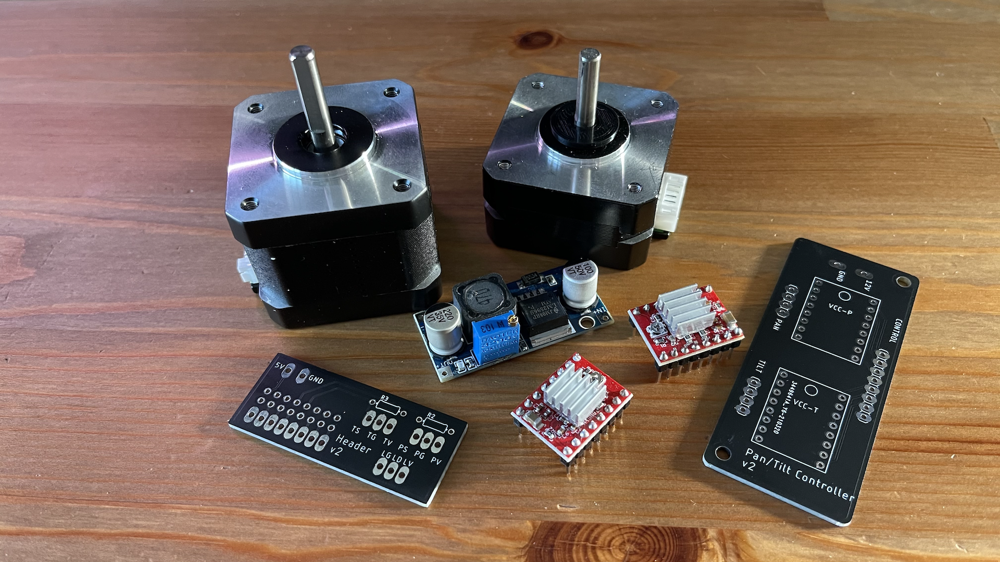

# Design 

## BOM
The following list of materials is required to assemble the camera setup:

* Raspberry Pi 4B
* Raspberry HQ Camera
* 30-50cm Raspberry Camera ribbon cable
* 1 NEMA 17 pancake motor for tilt axis
* 1 NEMA 17 motor for pan axis
* 2 A4988 stepper drivers
* 12V 3-5Amp power supply
* Buck converter (for 12V DC to 5V DC)
* 2 hall effect sensors (for limit switches)
* 2 10K resistors (for limit switches)
* 2 6mm neodymium magnets (for limit switches)
* 3D printed mount (Fusion 360 & STL files available below)
* Custom driver board and header board (Eagle and Gerber files available below)
* 13 pixel long WS2812B 60/m strand (for LED illumination and viewer indicator)    
* ~1m shielded 28AWG 3-wire cable (for limit switch cables)
* ~10cm 10-wire ribbon cable (for driver board to header board connection)
* 2 x ~60cm 4-wire stepper motor cables (may come with NEMA motors)
* ~70cm of ¼ nylon braided cable sleeving
* 4x M2.5x3-4mm screws (for securing buck converter and driver board)
* 8x 12-14mm rubber feet (4 for enclosure and 4 fo camera base)

## Mount and Enclosure Design
The enclosure case and the various parts of the mount itself were all custom designed from scratch using Autodesk Fusion 360. 
The objective was to make it as simple and modular as possible, while also making it reasonably compact.

The following is a list of parts together with links to the STL and the original Fusion design files:

#### Enclosure - [Fusion 360 File](../design/fusion360/PanTiltEnclosure%20v17.f3z)
* Enclosure bottom
* Enclosure top

#### Mount Assembly] - [Fusion 360 File](../design/fusion360/PanTiltMechanism%20v32.f3d)
* Pan motor mount
* Tilt motor mount
* Camera mount
* Camera plate
* Camera back plate ([design from Thingiverse](https://www.thingiverse.com/thing:4540545))
* Camera back clip
* Pan axle washer

## Electronics
A pair of simple PCBs was designed to allow for relatively simple assembly. The boards were designed using Autodesk Eagle.
Below are links to their schematic and board design files for Autodesk EAGLE:

The two boards are:
* Stepper Driver board for housing the two A4988 stepper drivers - [PCB](../design/eagle/PanTiltCtlBoard.brd) - [Schematic](../design/eagle/PanTiltCtlBoard.sch)
    * +12V/GND pads
    * 2 A4988 drivers (pan/tilt)
    * 8-pin header for harness connection to the Raspberry Pi header board

* Header break-out board for connecting to the top 16 GPIO pins of the Raspberry Pi - [PCB](../design/eagle/PanTiltHeader.brd) - [Schematic](../design/eagle/PanTiltHeader.sch)
    * 8 pads for harness interconnect with the stepper driver
    * +5V/GND to power Raspberry Pi
    * +3V3/GND/DATA pads for pan limit switch
    * +3V3/GND/DATA pads for tilt limit switch
    * +5V/GND/DATA pads for LED strip
  
The design folder also has ZIP files for ordering the PCBs on JLCPCB.

## Wiring Harnesses

* Motor Cables
    * Tilt: 56cm
    * Pan: 39cm
* Limit Sensor Cables
    * Tilt: 48cm
    * Pan: 25cm
* Sleeves for Cables
    * Tilt: 44cm
    * Pan: 20cm
* Header Ribbon Cable (8-wide)
    * 10cm
* LED Cable (5V/GND/Data)
    * 35cm
